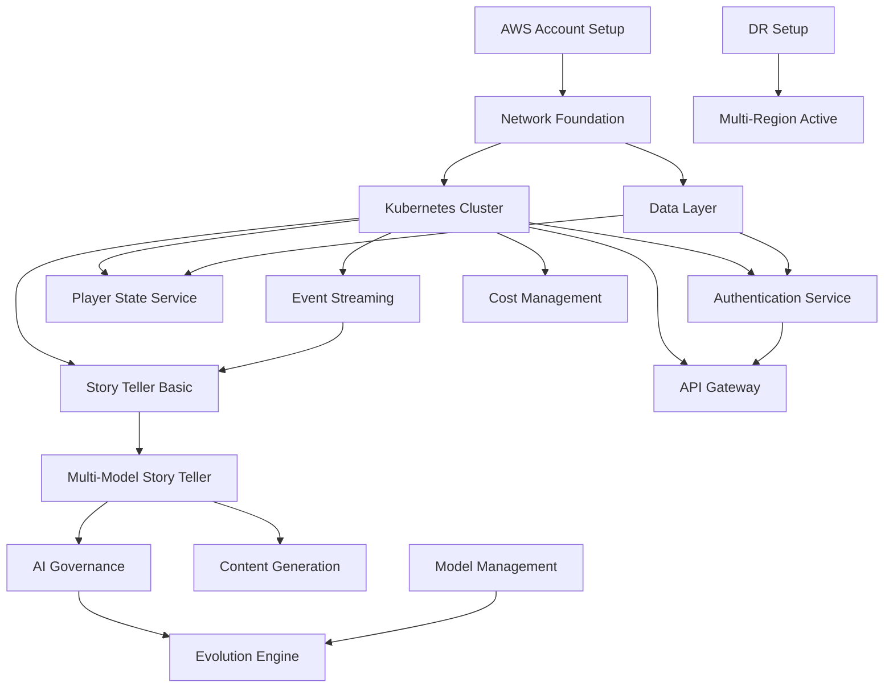

# Autonomous AI Core - Implementation Task List
**Version**: 1.0  
**Date**: 2025-11-18  
**Total Tasks**: 65  
**Estimated Timeline**: 12 months  
**Team Required**: 20+ engineers minimum

---

## MANDATORY RULES FOR ALL TASKS

1. **ALL code must be peer-coded** with 3+ models (Claude primary, reviewers: GPT-5.1, Gemini 2.5 Pro)
2. **ALL tests must be pairwise tested** (no mock code, no fake tests)
3. **Use BEST options, not cheapest** (infrastructure, services, tools)
4. **Follow /all-rules VERY CLOSELY** throughout implementation
5. **Timer service must run continuously** during all work
6. **Clean session aggressively** to maintain performance
7. **Burst-accept after file changes** to prevent dialog blocks
8. **NO summaries until complete** - show only work in progress
9. **Peer review EVERYTHING** - architecture, code, configurations
10. **Test comprehensively** - unit, integration, performance, security

---

## PHASE 1: FOUNDATION (Months 1-3)
**Goal**: Single region deployment with core services operational  
**Capacity**: 50k concurrent players, $500k/month budget

### Infrastructure Tasks

#### TASK-001: AWS Account Setup
- **Description**: Establish AWS Organizations structure with separate accounts
- **Components**:
  - Create AWS Organization root account
  - Setup separate accounts: dev, staging, prod, audit, billing
  - Configure consolidated billing
  - Establish IAM baseline policies
  - Enable CloudTrail in all accounts
- **Dependencies**: None
- **Success Criteria**: Multi-account structure with proper isolation
- **Team**: Platform Engineering
- **Priority**: P0 - Critical

#### TASK-002: Network Foundation
- **Description**: Create secure, scalable network architecture in us-east-1
- **Components**:
  - VPC with 3 availability zones
  - Public subnets for load balancers
  - Private subnets for applications
  - Database subnets with no internet access
  - NAT gateways for outbound traffic
  - VPN or Direct Connect for secure access
  - Network ACLs and security groups
- **Dependencies**: TASK-001
- **Success Criteria**: Network supporting 50k concurrent connections
- **Team**: Platform Engineering
- **Priority**: P0 - Critical

#### TASK-003: Kubernetes Cluster Deployment
- **Description**: Deploy production-grade EKS cluster
- **Components**:
  - EKS control plane (latest stable version)
  - Managed node groups for general compute
  - GPU node groups for AI workloads (g5.xlarge)
  - Cluster autoscaler configuration
  - Core operators: ingress, cert-manager, external-dns
  - Monitoring agents: Prometheus, Fluent Bit
  - GitOps setup with ArgoCD
- **Dependencies**: TASK-002
- **Success Criteria**: Cluster supporting 100+ microservices
- **Team**: Platform Engineering
- **Priority**: P0 - Critical

#### TASK-004: Data Layer Implementation
- **Description**: Deploy primary data storage systems
- **Components**:
  - Aurora PostgreSQL Multi-AZ cluster
  - Redis cluster for caching (3 nodes minimum)
  - DynamoDB tables for player profiles
  - S3 buckets: raw-data, processed-data, models, backups
  - Data lifecycle policies
  - Backup automation
  - Performance baselines
- **Dependencies**: TASK-002
- **Success Criteria**: <10ms P95 latency for queries
- **Team**: Platform Engineering
- **Priority**: P0 - Critical

#### TASK-005: Event Streaming Platform
- **Description**: Deploy Kafka for event-driven architecture
- **Components**:
  - MSK cluster with 3 brokers minimum
  - Schema Registry deployment
  - Topic creation with governance
  - Retention policies (7 days default)
  - Monitoring and alerting
  - Producer/consumer libraries
  - Dead letter queue setup
- **Dependencies**: TASK-003
- **Success Criteria**: 100k messages/second throughput
- **Team**: Platform Engineering
- **Priority**: P0 - Critical

### Core Services Tasks

#### TASK-006: Player State Service
- **Description**: Real-time player state management with strong consistency
- **Components**:
  - API design with OpenAPI spec
  - Aurora PostgreSQL integration
  - Redis caching layer
  - Optimistic locking implementation
  - State synchronization logic
  - Performance optimization
  - Comprehensive testing
- **Dependencies**: TASK-003, TASK-004
- **Success Criteria**: <50ms P95 latency for state updates
- **Team**: Game Services
- **Priority**: P0 - Critical

#### TASK-007: Authentication Service
- **Description**: Secure player authentication and session management
- **Components**:
  - JWT-based authentication
  - OAuth2 integration
  - Rate limiting per player
  - Session management in Redis
  - Password policies
  - Account recovery flows
  - Security testing
- **Dependencies**: TASK-003, TASK-004
- **Success Criteria**: 10k authentications/second
- **Team**: Game Services
- **Priority**: P0 - Critical

#### TASK-008: Basic Story Teller Service
- **Description**: Initial AI narrative system with single model
- **Components**:
  - GPT-5.1 integration
  - Prompt management system
  - Content safety filters
  - Decision logging
  - Context management
  - Error handling
  - A/B testing framework
- **Dependencies**: TASK-003, TASK-005
- **Success Criteria**: <1s response time for decisions
- **Team**: AI/ML Engineering
- **Priority**: P1 - High

#### TASK-009: Cost Management Service
- **Description**: Real-time cost tracking and optimization
- **Components**:
  - AWS Cost Explorer API integration
  - Real-time cost aggregation
  - Budget alerts
  - Service cost attribution
  - Degradation policies
  - Cost dashboards
  - Optimization recommendations
- **Dependencies**: TASK-003
- **Success Criteria**: <5% cost tracking error
- **Team**: Platform Engineering
- **Priority**: P1 - High

#### TASK-010: API Gateway Setup
- **Description**: External API management and routing
- **Components**:
  - Kong or AWS API Gateway deployment
  - Route configuration
  - Authentication integration
  - Rate limiting rules
  - Request/response transformation
  - API documentation
  - Developer portal
- **Dependencies**: TASK-003, TASK-007
- **Success Criteria**: 50k requests/second capacity
- **Team**: Platform Engineering
- **Priority**: P0 - Critical

### Observability Tasks

#### TASK-011: Monitoring Stack
- **Description**: Comprehensive metrics collection and visualization
- **Components**:
  - Prometheus deployment with HA
  - Service discovery configuration
  - Custom metrics exporters
  - Grafana with dashboards
  - CloudWatch integration
  - Alert rule configuration
  - SLO tracking
- **Dependencies**: TASK-003
- **Success Criteria**: All services monitored with <1min delay
- **Team**: Platform Engineering
- **Priority**: P0 - Critical

#### TASK-012: Logging Infrastructure
- **Description**: Centralized logging with search capabilities
- **Components**:
  - Elasticsearch cluster (3 nodes)
  - Fluent Bit on all nodes
  - Log parsing rules
  - Index lifecycle management
  - Kibana dashboards
  - Log retention policies
  - Security audit trails
- **Dependencies**: TASK-003
- **Success Criteria**: 1TB/day log ingestion capacity
- **Team**: Platform Engineering
- **Priority**: P0 - Critical

#### TASK-013: Distributed Tracing
- **Description**: Request tracing across microservices
- **Components**:
  - Jaeger deployment
  - OpenTelemetry agents
  - Trace sampling configuration
  - Service instrumentation
  - Performance baselines
  - Critical path analysis
  - Trace retention
- **Dependencies**: TASK-003
- **Success Criteria**: <1% performance overhead
- **Team**: Platform Engineering
- **Priority**: P1 - High

#### TASK-014: Alerting Configuration
- **Description**: Incident detection and notification
- **Components**:
  - PagerDuty integration
  - Alert routing rules
  - Severity definitions
  - Escalation policies
  - On-call schedules
  - Alert suppression
  - Testing procedures
- **Dependencies**: TASK-011
- **Success Criteria**: <1min alert latency
- **Team**: Platform Engineering
- **Priority**: P0 - Critical

#### TASK-015: Runbook Automation
- **Description**: Operational procedures and automation
- **Components**:
  - Top 10 scenario documentation
  - Automation scripts
  - Runbook testing
  - Team training
  - Update procedures
  - Effectiveness metrics
  - Continuous improvement
- **Dependencies**: TASK-011, TASK-014
- **Success Criteria**: 80% scenarios automated
- **Team**: All Teams
- **Priority**: P1 - High

### Security Tasks

#### TASK-016: Security Baseline
- **Description**: Foundational security controls
- **Components**:
  - WAF deployment and rules
  - DDoS protection (Shield Advanced)
  - Network security groups
  - Encryption at rest (KMS)
  - Encryption in transit (TLS 1.3)
  - Security scanning tools
  - Vulnerability management
- **Dependencies**: TASK-002
- **Success Criteria**: Pass security audit
- **Team**: Security Operations
- **Priority**: P0 - Critical

#### TASK-017: IAM and Access Control
- **Description**: Identity and access management
- **Components**:
  - Kubernetes RBAC policies
  - AWS IAM roles and policies
  - Service account management
  - Secrets Manager integration
  - MFA enforcement
  - Access reviews
  - Privilege escalation prevention
- **Dependencies**: TASK-001, TASK-003
- **Success Criteria**: Zero privilege escalation paths
- **Team**: Security Operations
- **Priority**: P0 - Critical

#### TASK-018: Compliance Framework
- **Description**: Regulatory compliance implementation
- **Components**:
  - GDPR data handling procedures
  - Data classification
  - Retention policies
  - Right to deletion
  - Consent management
  - Audit logging
  - Compliance reporting
- **Dependencies**: TASK-004, TASK-012
- **Success Criteria**: GDPR compliance certified
- **Team**: Security Operations
- **Priority**: P0 - Critical

#### TASK-019: Security Monitoring
- **Description**: Threat detection and response
- **Components**:
  - GuardDuty enablement
  - Security Hub configuration
  - Custom threat detectors
  - SIEM integration
  - Incident response procedures
  - Forensics capabilities
  - Regular reviews
- **Dependencies**: TASK-012, TASK-016
- **Success Criteria**: <15min threat detection
- **Team**: Security Operations
- **Priority**: P1 - High

#### TASK-020: Penetration Testing
- **Description**: Security validation through testing
- **Components**:
  - External firm engagement
  - API security testing
  - AI prompt injection tests
  - Infrastructure testing
  - Social engineering tests
  - Remediation tracking
  - Retest validation
- **Dependencies**: All Phase 1 tasks
- **Success Criteria**: No critical findings
- **Team**: Security Operations
- **Priority**: P1 - High

---

## PHASE 2: ENHANCED AI (Months 4-6)
**Goal**: Multi-model AI, disaster recovery, enhanced features  
**Capacity**: 200k concurrent players, $1M/month budget

### AI Enhancement Tasks

#### TASK-021: Multi-Model Story Teller
- **Description**: Implement 3-model ensemble system
- **Components**:
  - GPT-5.1, Claude 4.1, Gemini 2.5 Pro integration
  - Consensus mechanism implementation
  - Weighted voting system
  - Circuit breaker per model
  - Performance optimization
  - Fallback strategies
  - Comprehensive testing
- **Dependencies**: TASK-008
- **Success Criteria**: <2s decision time with consensus
- **Team**: AI/ML Engineering
- **Priority**: P0 - Critical

#### TASK-022: AI Governance System
- **Description**: Decision control and oversight
- **Components**:
  - Impact classification system
  - Human approval workflow
  - Audit trail enhancements
  - Governance dashboard
  - Policy engine
  - Override mechanisms
  - Compliance reporting
- **Dependencies**: TASK-021
- **Success Criteria**: 100% high-impact decisions reviewed
- **Team**: AI/ML Engineering
- **Priority**: P0 - Critical

#### TASK-023: Content Generation Service
- **Description**: AI-powered content creation
- **Components**:
  - Stable Diffusion XL integration
  - Quest generation system
  - Dialogue synthesis
  - Asset optimization
  - Multi-stage safety filters
  - Quality validation
  - Performance optimization
- **Dependencies**: TASK-021
- **Success Criteria**: 1000 quests/hour generation
- **Team**: AI/ML Engineering
- **Priority**: P1 - High

#### TASK-024: Disaster Recovery Setup
- **Description**: Passive region for business continuity
- **Components**:
  - EU-West-1 infrastructure
  - Data replication setup
  - Failover procedures
  - Recovery testing
  - Runbook creation
  - Team training
  - Regular drills
- **Dependencies**: Phase 1 completion
- **Success Criteria**: 30-min RTO, 5-min RPO
- **Team**: Platform Engineering
- **Priority**: P0 - Critical

#### TASK-025: Enhanced Monitoring
- **Description**: AI-specific observability
- **Components**:
  - Model performance metrics
  - Decision quality tracking
  - Cost per inference
  - A/B test analytics
  - Bias detection
  - Drift monitoring
  - Custom dashboards
- **Dependencies**: TASK-021
- **Success Criteria**: Real-time model insights
- **Team**: AI/ML Engineering
- **Priority**: P1 - High

### Advanced Features

#### TASK-026: Player Experience Service
- **Description**: Personalization and recommendations
- **Components**:
  - Player profiling system
  - Recommendation engine
  - Difficulty adjustment
  - Preference learning
  - Feedback processing
  - Privacy controls
  - Performance optimization
- **Dependencies**: TASK-006
- **Success Criteria**: 90% recommendation relevance
- **Team**: Game Services
- **Priority**: P1 - High

#### TASK-027: A/B Testing Framework
- **Description**: Experimentation infrastructure
- **Components**:
  - Experiment management system
  - Statistical analysis engine
  - Automated rollout decisions
  - Feature flag integration
  - Results dashboard
  - Safety checks
  - Documentation
- **Dependencies**: TASK-010
- **Success Criteria**: 100 concurrent experiments
- **Team**: Platform Engineering
- **Priority**: P1 - High

#### TASK-028: Model Management Platform
- **Description**: ML model lifecycle management
- **Components**:
  - Model registry (MLflow)
  - Version control
  - Deployment automation
  - Performance tracking
  - Rollback capabilities
  - A/B testing integration
  - Cost tracking
- **Dependencies**: TASK-021
- **Success Criteria**: <5min model deployment
- **Team**: AI/ML Engineering
- **Priority**: P1 - High

#### TASK-029: GPU Optimization
- **Description**: Inference cost reduction
- **Components**:
  - Model quantization pipeline
  - Batch optimization
  - GPU scheduling improvements
  - Mixed precision training
  - Caching strategies
  - Performance profiling
  - Cost analysis
- **Dependencies**: TASK-021
- **Success Criteria**: 50% cost reduction
- **Team**: AI/ML Engineering
- **Priority**: P1 - High

#### TASK-030: Load Testing
- **Description**: Capacity validation at scale
- **Components**:
  - Synthetic player generation
  - Scenario scripting
  - 200k concurrent test
  - Bottleneck identification
  - Performance optimization
  - Report generation
  - Improvement tracking
- **Dependencies**: Phase 2 services
- **Success Criteria**: Meet all SLOs at 200k
- **Team**: All Teams
- **Priority**: P0 - Critical

---

## PHASE 3: GLOBAL SCALE (Months 7-12)
**Goal**: Multi-region active, full autonomy, 1M+ players  
**Capacity**: Global deployment, $3M/month budget

### Global Infrastructure

#### TASK-031: Multi-Region Active
- **Description**: Global deployment with regional autonomy
- **Components**:
  - EU-West-1 active region
  - AP-Southeast-1 active region
  - Cross-region networking
  - Data synchronization
  - Traffic routing policies
  - Regional compliance
  - Performance optimization
- **Dependencies**: TASK-024
- **Success Criteria**: <100ms regional latency
- **Team**: Platform Engineering
- **Priority**: P0 - Critical

#### TASK-032: Evolution Engine
- **Description**: Self-improvement capabilities
- **Components**:
  - Hypothesis generation system
  - Simulation framework
  - Safety validation
  - Automated deployment
  - Human approval gates
  - Rollback mechanisms
  - Success tracking
- **Dependencies**: TASK-022, TASK-028
- **Success Criteria**: 10 improvements/month
- **Team**: AI/ML Engineering
- **Priority**: P2 - Medium

#### TASK-033: Self-Healing Infrastructure
- **Description**: Autonomous failure recovery
- **Components**:
  - Anomaly detection system
  - Automated remediation
  - Predictive failure prevention
  - Chaos engineering tests
  - Recovery validation
  - Performance tracking
  - Continuous improvement
- **Dependencies**: TASK-015
- **Success Criteria**: 99.99% uptime
- **Team**: Platform Engineering
- **Priority**: P1 - High

#### TASK-034: Global Event System
- **Description**: Cross-region event coordination
- **Components**:
  - Event synchronization
  - Conflict resolution (CRDTs)
  - Player state reconciliation
  - Latency compensation
  - Regional variations
  - Performance optimization
  - Testing framework
- **Dependencies**: TASK-031
- **Success Criteria**: <5s global consistency
- **Team**: Game Services
- **Priority**: P1 - High

#### TASK-035: Advanced Cost Optimization
- **Description**: Cost reduction at scale
- **Components**:
  - Spot instance integration
  - Reserved capacity planning
  - Regional cost arbitrage
  - Workload scheduling
  - Waste elimination
  - Budget automation
  - ROI tracking
- **Dependencies**: TASK-009
- **Success Criteria**: <$2/player/month
- **Team**: Platform Engineering
- **Priority**: P1 - High

### Full Autonomy

#### TASK-036: Autonomous Decision Making
- **Description**: Policy-driven automation
- **Components**:
  - Policy engine implementation
  - Constraint definition system
  - Risk assessment automation
  - Decision boundaries
  - Override capabilities
  - Audit logging
  - Compliance validation
- **Dependencies**: TASK-022, TASK-032
- **Success Criteria**: 95% decisions automated
- **Team**: AI/ML Engineering
- **Priority**: P2 - Medium

#### TASK-037: MCP Server Integration
- **Description**: Tool ecosystem expansion
- **Components**:
  - Discovery mechanisms
  - Capability evaluation
  - Sandboxed execution
  - Performance monitoring
  - Security validation
  - Cost tracking
  - Documentation
- **Dependencies**: TASK-003
- **Success Criteria**: 50+ integrated tools
- **Team**: Platform Engineering
- **Priority**: P2 - Medium

#### TASK-038: Internet Access Security
- **Description**: Secure external connectivity
- **Components**:
  - Zero-trust architecture
  - Advanced threat detection
  - Sandboxing implementation
  - Traffic inspection
  - Security automation
  - Incident response
  - Compliance validation
- **Dependencies**: TASK-016, TASK-019
- **Success Criteria**: Zero security breaches
- **Team**: Security Operations
- **Priority**: P0 - Critical

#### TASK-039: Continuous Learning
- **Description**: Ongoing improvement system
- **Components**:
  - Feedback loop implementation
  - Model improvement pipeline
  - A/B testing automation
  - Performance tracking
  - Knowledge retention
  - Transfer learning
  - Success metrics
- **Dependencies**: TASK-032
- **Success Criteria**: 5% monthly improvement
- **Team**: AI/ML Engineering
- **Priority**: P2 - Medium

#### TASK-040: Production Hardening
- **Description**: Final reliability validation
- **Components**:
  - Comprehensive chaos testing
  - Regional failover tests
  - 1M+ player load test
  - Security penetration testing
  - Performance optimization
  - Documentation update
  - Team readiness
- **Dependencies**: All previous tasks
- **Success Criteria**: Pass all tests
- **Team**: All Teams
- **Priority**: P0 - Critical

---

## CROSS-PHASE OPERATIONAL TASKS

### Team and Process

#### TASK-041: Team Building
- **Description**: Hire and onboard required staff
- **Components**:
  - Platform engineers (6-8)
  - ML ops specialists (4-6)
  - Game services engineers (6-10)
  - Security engineers (2-3)
  - Data engineers (4-5)
  - Interview process
  - Onboarding program
- **Dependencies**: None
- **Success Criteria**: Full team by Month 3
- **Team**: Management
- **Priority**: P0 - Critical

#### TASK-042: Documentation
- **Description**: Comprehensive system documentation
- **Components**:
  - Architecture documentation
  - API specifications
  - Runbook library
  - Troubleshooting guides
  - Design decisions
  - Code documentation
  - Knowledge base
- **Dependencies**: Ongoing with each task
- **Success Criteria**: 100% coverage
- **Team**: All Teams
- **Priority**: P1 - High

#### TASK-043: Training Program
- **Description**: Team capability development
- **Components**:
  - Technology deep dives
  - On-call training
  - Incident response drills
  - Security awareness
  - AI/ML fundamentals
  - Platform specifics
  - Certification support
- **Dependencies**: TASK-041
- **Success Criteria**: All team certified
- **Team**: Management
- **Priority**: P1 - High

#### TASK-044: Vendor Management
- **Description**: Third-party relationships
- **Components**:
  - AWS enterprise support
  - GPU capacity reservations
  - Security vendor contracts
  - SaaS tool procurement
  - SLA negotiations
  - Cost optimization
  - Regular reviews
- **Dependencies**: None
- **Success Criteria**: All contracts in place
- **Team**: Management
- **Priority**: P1 - High

#### TASK-045: Legal and Compliance
- **Description**: Regulatory preparedness
- **Components**:
  - Terms of service updates
  - Privacy policy creation
  - Data processing agreements
  - Regional compliance audits
  - Legal counsel engagement
  - Policy documentation
  - Regular reviews
- **Dependencies**: TASK-018
- **Success Criteria**: Full compliance
- **Team**: Legal/Security
- **Priority**: P0 - Critical

### Development Infrastructure

#### TASK-046: CI/CD Pipeline
- **Description**: Automated software delivery
- **Components**:
  - GitLab configuration
  - Build automation
  - Test automation
  - Security scanning
  - Artifact management
  - Deployment automation
  - Pipeline monitoring
- **Dependencies**: TASK-003
- **Success Criteria**: <30min deployments
- **Team**: Platform Engineering
- **Priority**: P0 - Critical

#### TASK-047: Environment Management
- **Description**: Dev/staging/prod separation
- **Components**:
  - Environment provisioning
  - Configuration management
  - Secrets handling
  - Data isolation
  - Access controls
  - Refresh procedures
  - Cost tracking
- **Dependencies**: TASK-001
- **Success Criteria**: 100% parity
- **Team**: Platform Engineering
- **Priority**: P0 - Critical

#### TASK-048: Deployment Automation
- **Description**: Reliable release process
- **Components**:
  - Kubernetes manifests
  - Helm chart creation
  - Progressive rollout tools
  - Rollback procedures
  - Smoke tests
  - Validation gates
  - Documentation
- **Dependencies**: TASK-046
- **Success Criteria**: Zero-downtime deploys
- **Team**: Platform Engineering
- **Priority**: P0 - Critical

#### TASK-049: Development Tools
- **Description**: Developer productivity
- **Components**:
  - Local dev environment
  - Debugging tools
  - Performance profiling
  - AI testing tools
  - IDE configurations
  - Scripts and utilities
  - Documentation
- **Dependencies**: TASK-003
- **Success Criteria**: <5min dev setup
- **Team**: Platform Engineering
- **Priority**: P1 - High

#### TASK-050: Quality Assurance
- **Description**: Comprehensive testing strategy
- **Components**:
  - Unit test frameworks
  - Integration testing
  - End-to-end testing
  - AI output validation
  - Performance testing
  - Security testing
  - Coverage targets
- **Dependencies**: TASK-046
- **Success Criteria**: >80% coverage
- **Team**: All Teams
- **Priority**: P0 - Critical

### Continuous Improvement

#### TASK-051: Performance Optimization
- **Description**: Ongoing performance improvements
- **Components**:
  - Query optimization
  - Caching strategies
  - CDN configuration
  - Code profiling
  - Latency reduction
  - Resource efficiency
  - Benchmark tracking
- **Dependencies**: Ongoing
- **Success Criteria**: 10% monthly improvement
- **Team**: All Teams
- **Priority**: P1 - High

#### TASK-052: Technical Debt Management
- **Description**: Code and architecture health
- **Components**:
  - Refactoring backlog
  - Dependency updates
  - Architecture reviews
  - Code quality metrics
  - Deprecation planning
  - Modernization efforts
  - Tracking system
- **Dependencies**: Ongoing
- **Success Criteria**: <20% tech debt ratio
- **Team**: All Teams
- **Priority**: P2 - Medium

#### TASK-053: Incident Management
- **Description**: Learning from failures
- **Components**:
  - Postmortem process
  - Root cause analysis
  - Action item tracking
  - Knowledge sharing
  - Trend analysis
  - Prevention measures
  - Tool improvements
- **Dependencies**: TASK-014
- **Success Criteria**: <5% repeat incidents
- **Team**: All Teams
- **Priority**: P1 - High

#### TASK-054: Capacity Planning
- **Description**: Resource forecasting
- **Components**:
  - Growth projections
  - Resource modeling
  - Procurement planning
  - Budget forecasting
  - Optimization opportunities
  - Regular reviews
  - Automation tools
- **Dependencies**: TASK-011
- **Success Criteria**: Zero capacity emergencies
- **Team**: Platform Engineering
- **Priority**: P1 - High

#### TASK-055: Innovation Pipeline
- **Description**: Stay ahead of competition
- **Components**:
  - New AI model evaluation
  - Technology assessment
  - Competitive analysis
  - Prototype development
  - Feature roadmap
  - Research partnerships
  - Knowledge sharing
- **Dependencies**: Ongoing
- **Success Criteria**: 3 innovations/quarter
- **Team**: AI/ML Engineering
- **Priority**: P2 - Medium

### Risk Mitigation

#### TASK-056: Fallback Systems
- **Description**: Graceful degradation capabilities
- **Components**:
  - Degraded mode operations
  - Feature flags for disabling
  - Emergency cost controls
  - Manual override systems
  - Fallback configurations
  - Testing procedures
  - Documentation
- **Dependencies**: TASK-027
- **Success Criteria**: 100% feature coverage
- **Team**: All Teams
- **Priority**: P1 - High

#### TASK-057: Backup and Recovery
- **Description**: Data protection systems
- **Components**:
  - Automated backup jobs
  - Cross-region replication
  - Point-in-time recovery
  - Recovery testing
  - Backup monitoring
  - Retention management
  - Documentation
- **Dependencies**: TASK-004
- **Success Criteria**: <1hr recovery time
- **Team**: Platform Engineering
- **Priority**: P0 - Critical

#### TASK-058: Security Response
- **Description**: Incident handling capabilities
- **Components**:
  - Response plan creation
  - Team on-call setup
  - Forensics tools
  - Communication procedures
  - Vendor relationships
  - Regular drills
  - Improvement tracking
- **Dependencies**: TASK-019
- **Success Criteria**: <30min response time
- **Team**: Security Operations
- **Priority**: P1 - High

#### TASK-059: Business Continuity
- **Description**: Operational resilience
- **Components**:
  - DR procedures
  - Vendor alternatives
  - Team redundancy
  - Knowledge transfer
  - Communication plans
  - Regular testing
  - Documentation
- **Dependencies**: TASK-024
- **Success Criteria**: 99.99% availability
- **Team**: Management
- **Priority**: P1 - High

#### TASK-060: Regulatory Preparedness
- **Description**: Compliance readiness
- **Components**:
  - Audit preparation
  - Documentation library
  - Process evidence
  - Change monitoring
  - Legal relationships
  - Regular assessments
  - Improvement plans
- **Dependencies**: TASK-045
- **Success Criteria**: Pass all audits
- **Team**: Legal/Security
- **Priority**: P1 - High

### Launch Preparation

#### TASK-061: Readiness Review
- **Description**: Pre-launch validation
- **Components**:
  - Checklist validation
  - Stakeholder sign-offs
  - Risk assessment
  - Mitigation verification
  - Go/no-go criteria
  - Decision process
  - Documentation
- **Dependencies**: All tasks
- **Success Criteria**: 100% checklist pass
- **Team**: Management
- **Priority**: P0 - Critical

#### TASK-062: Launch Planning
- **Description**: Coordinated go-live
- **Components**:
  - Communication plans
  - Support readiness
  - Monitoring setup
  - Escalation procedures
  - Rollback plans
  - Success metrics
  - Timeline creation
- **Dependencies**: TASK-061
- **Success Criteria**: Zero launch issues
- **Team**: All Teams
- **Priority**: P0 - Critical

#### TASK-063: Phased Execution
- **Description**: Controlled rollout
- **Components**:
  - Beta user selection
  - Traffic ramping plan
  - Performance monitoring
  - Issue tracking
  - Feedback collection
  - Adjustment procedures
  - Success tracking
- **Dependencies**: TASK-062
- **Success Criteria**: <0.1% error rate
- **Team**: All Teams
- **Priority**: P0 - Critical

#### TASK-064: Post-Launch Support
- **Description**: Stabilization phase
- **Components**:
  - 24/7 monitoring
  - Rapid response team
  - Performance tuning
  - Bug fixing
  - Player support
  - Communication updates
  - Metric tracking
- **Dependencies**: TASK-063
- **Success Criteria**: All SLOs met
- **Team**: All Teams
- **Priority**: P0 - Critical

#### TASK-065: Success Validation
- **Description**: Achievement verification
- **Components**:
  - SLO measurement
  - Cost analysis
  - Player satisfaction
  - System stability
  - Team performance
  - Lesson learned
  - Future planning
- **Dependencies**: TASK-064
- **Success Criteria**: All targets achieved
- **Team**: Management
- **Priority**: P0 - Critical

---

## TASK DEPENDENCIES SUMMARY

---

## RESOURCE ALLOCATION

### Team Assignment Matrix
| Team | Phase 1 Tasks | Phase 2 Tasks | Phase 3 Tasks | Total |
|------|--------------|--------------|--------------|-------|
| Platform Engineering | 11 | 4 | 5 | 20 |
| AI/ML Engineering | 2 | 7 | 4 | 13 |
| Game Services | 3 | 2 | 1 | 6 |
| Security Operations | 5 | 0 | 1 | 6 |
| Management | 3 | 1 | 4 | 8 |
| All Teams | 2 | 2 | 5 | 9 |

### Critical Path
1. AWS Account Setup → Network → Kubernetes → Core Services
2. Basic AI → Multi-Model → Governance → Evolution
3. Single Region → DR → Multi-Region → Global Scale

### Budget Allocation
- Phase 1: $1.5M (infrastructure + team)
- Phase 2: $3M (AI enhancement + scaling)
- Phase 3: $6M (global deployment + operations)
- Total: $10.5M over 12 months

---

## SUCCESS METRICS

### Phase 1 Success Criteria
- [ ] 50k concurrent players supported
- [ ] 99.9% uptime achieved
- [ ] <200ms P95 latency
- [ ] <$500k/month costs
- [ ] Zero security breaches

### Phase 2 Success Criteria
- [ ] 200k concurrent players supported
- [ ] 99.95% uptime achieved
- [ ] <150ms P95 latency
- [ ] AI consensus working
- [ ] DR tested successfully

### Phase 3 Success Criteria
- [ ] 1M+ concurrent players supported
- [ ] 99.99% uptime achieved
- [ ] <100ms P95 latency
- [ ] Full autonomy operational
- [ ] <$2/player/month costs

---

## RISK REGISTER

| Risk | Probability | Impact | Mitigation |
|------|------------|---------|------------|
| GPU shortage | High | Critical | Reserve capacity early |
| Cost overrun | Medium | High | Strict monitoring and controls |
| Team hiring delays | Medium | High | Start recruiting immediately |
| Security breach | Low | Critical | Defense in depth strategy |
| AI safety incident | Medium | Critical | Multiple safety layers |

---

## NEXT STEPS

1. **Immediate Actions**:
   - Begin team hiring (TASK-041)
   - Setup AWS accounts (TASK-001)
   - Engage vendors (TASK-044)

2. **Week 1 Priorities**:
   - Complete account structure
   - Start network design
   - Interview first candidates

3. **Month 1 Goals**:
   - Core infrastructure deployed
   - 50% team hired
   - Development environment ready

---

**Remember**: Follow /all-rules for EVERY task. Peer review ALL work. Test EVERYTHING comprehensively.

---
